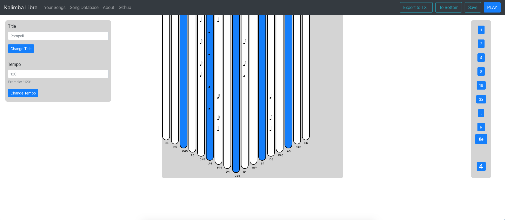
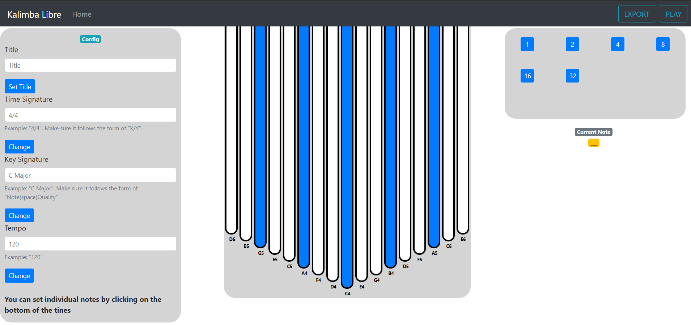

# Kalimba Libre

A WIP React Web App for creating Kalimba tablatures for free (see: _Libre_)

Link for what I've created so far: http://kalimba-libre.herokuapp.com/.
If it takes a long time to load, it's because heroku has put it on low priority. It will take around ~30 seconds. **If you notice any bugs while using it, report them here!** Right now I'm working on database things locally, so the site could be a bit borked. I'm pretty sure you can at least still make a new tab and fiddle around with it, but it won't save (pressing `Save` might even crash the app).

## Development

### Setup

1. Clone the repository with
   `git clone https://github.com/oakleyaidan21/KalimbaLibre.git`

2. Run `npm install`

3. Run `npm start`

And you're done! The app will be running on `localhost:3000`. If by any chance npm yelled at you to install certain dependencies, do so.

## Current Look

Here's how the app looks at this stage in development:

## TO-DO

- [x] Align noteHolder so that it starts from the bottom of the holder div
- [x] Make function to highlight totalNotes going up the holder
- [x] Actually nail down a midi player to use going forward
- [x] Find way to export the `KalimbaContainer` _though it's not entirely working yet_
- [x] _Refactor components to be less confusing_ (this project started as a way to learn react, so component hiearchy is kinda borked) Should probably combine components into each other, as some don't need to be reused (i.e., Note)
- [x] Make config and selector elements actually control variables that App uses
- [x] Render note icons instead of purple squares on kalimba
  - [ ] Get images for every type of note
- [x] Fix note timing calculation for dotted notes
- [x] Find way to export note placements
- [ ] Update selector to have note icons instead of numbers
- [ ] Clean up all code
- [ ] Everything else! :^)

## CURRENT ISSUES

- notes will not re-render as their correct note icon, but they will render timing correct
- updating a saved song and saving it again will change everything but the songString
- need to be able to set up the api remotely somehow (heroku?)
- major doesn't change from C when playing song, but is changed when inputting notes
