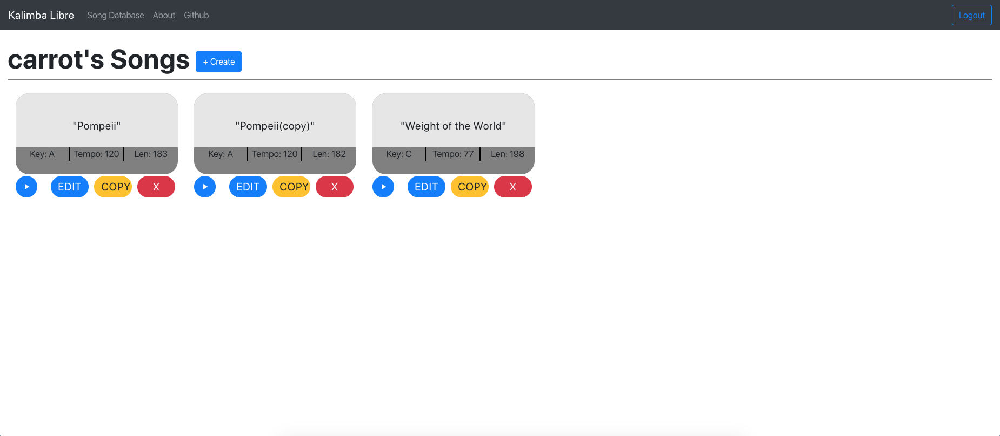

# Kalimba Libre

A WIP React Web App for creating Kalimba tablatures for free (see: _Libre_)

## Development

### Setup

1. Clone the repository with
   `git clone https://github.com/oakleyaidan21/KalimbaLibre.git`

2. Run `npm install`

3. Run `npm start`

And you're done! The app will be running on `localhost:3000`. If by any chance npm yelled at you to install certain dependencies, do so.

#### Production Build

If you want to run the app as a production build, use these commands:

1. `npm run build`
2. `serve -s build`

If it yells at you to install a dependency, do so.

## Current Look

Here's how the app looks at this stage in development:

## TO-DO

- [ ] Add rest functionality (along with corresponding export handling)
- [ ] Add a savable description
- [ ] Add tied note functionality (along with corresponding export handling)
- [ ] Move database to higher priority server
- [ ] Add functionality for copying a selection of notes
